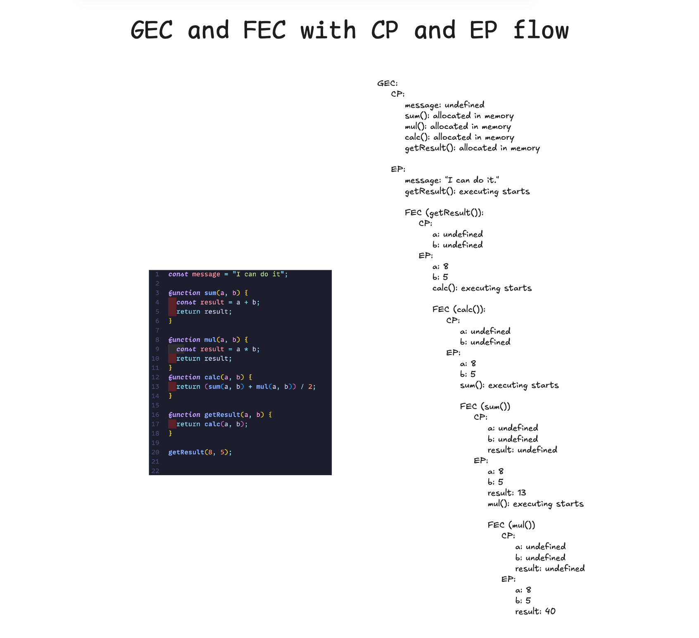
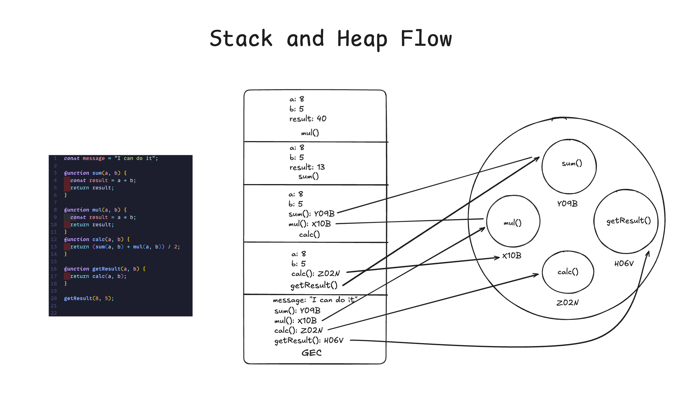
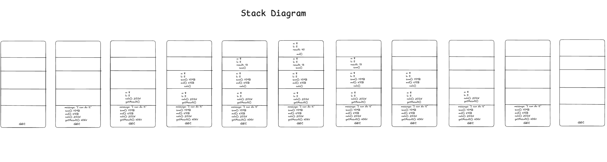

# Day 08 - 40 Days of JavaScript

## **🎯 Goal of This Lesson**

- ✅ Welcome to Module 2
- ✅ Why Execution Context
- ✅ Lexical Environment
- ✅ Execution Context
- ✅ Global Execution Context
- ✅ Function Execution Context
- ✅ GEC and FEC With Complex Examples
- ✅ Memory Management With Call Stack and Heap

## 🎨 Diagrams

[Live Link of the Diagrams](https://excalidraw.com/#json=lkNjNnj51CqIxT-TVirto,hSbb3tfmAFIDADyM7GXlrw)

## GEC and FEC with CP and EP flow

## Stack and Heap Flow

## Stack Diagram

